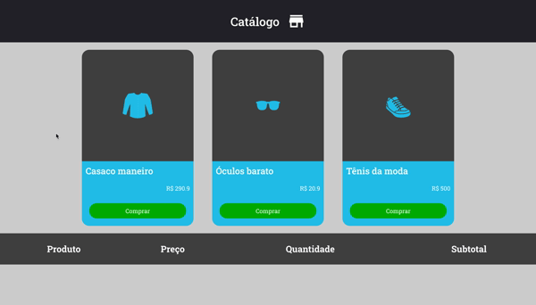

<h1 align="center">
    
    <br>
    Redux Shopping Cart
    <br>
    
    
    
    
</h1>

<div align="center">
    <h4 style="margin-bottom: 0;"> 🏁  Finished.  🏁</h4>
    <h5 style="margin-top: 0;">(for now)</h5>
</div>

<p align="center">Redux Shopping Cart is a project created to get familiar with the use of Redux and Redux saga technology.</p>

<p align="center">
 <a href="#-goal">Goal</a> •
 <a href="#-features">Features</a> • 
 <a href="#-requirements">Requirements</a> • 
 <a href="#%EF%B8%8F-runing-project-%EF%B8%8F">Running project</a> • 
 <a href="#-technologies">Technologies</a> • 
 <a href="#%EF%B8%8F-author">Author</a>
</p>

## 🎯 Goal

<p align="center">Redux Shopping Cart is a small and simple project developed to apply the flux architecture concepts to a shopping cart web page, using the Redux and Redux saga technology.</p>

## 🎩 Features

- [x] List products
- [x] Add products to cart
- [x] Prevents sold out products from beeing added to cart

## 👨🏻‍🔬 Requirements

Before we begin, you'll need to have the following dependencies installed:
[Git](https://git-scm.com), [Node.js](https://nodejs.org/en/) and [Yarn](https://yarnpkg.com/).
Besides, it would be great that you have a code editor to work on this project, such as [VSCode](https://code.visualstudio.com/).

## 🏃‍♀️ Runing project 🏃‍♂️

```bash
# Clone the repo
$ git clone <https://github.com/thalessarubbi/redux-shopping-cart.git>

# Access project folder from a terminal
$ cd redux-shopping-cart

# Install dependencies
$ yarn


#### Start fake sever ####
$ yarn server

# The server will start at port :3333 - access <http://localhost:3333>


#### Start web app ####
$ yarn start

# The web app will start at port :3000 - access <http://localhost:3000>
```

## 🛠 Technologies

- [React](https://pt-br.reactjs.org/)
- [Redux](https://redux.js.org/)
- [Redux saga](https://redux-saga.js.org/)
- [Axios](https://github.com/axios/axios)
- [styled-components](https://github.com/axios/axios)
- [VS Code](https://code.visualstudio.com/)

## ✍️ Author
---
<br />

<br />
<sub><b>Thales Sarubbi</b></sub>


Made with 💙 by Thales Sarubbi 🗣 Let's talk!


[](https://www.linkedin.com/in/thales-sarubbi/) 
[](mailto:thalessarubbi@gmail.com)
